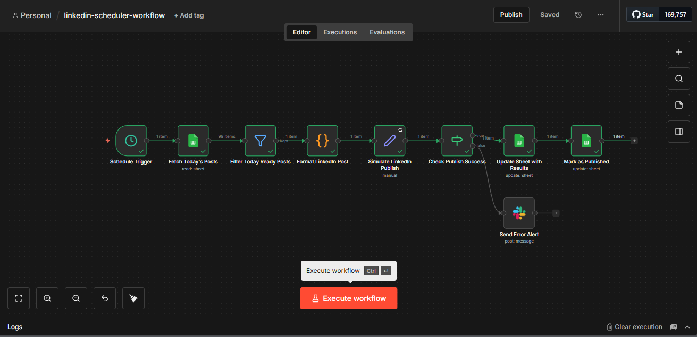

# LinkedIn Content Scheduler

> Automated LinkedIn publishing system using n8n to batch-create posts in Google Sheets, evaluate scheduling, and publish daily without manual effort

[](LICENSE)
[](https://n8n.io)



---

## Table of Contents

- [Overview](#overview)
- [Features](#features)
- [Demo](#demo)
- [Prerequisites](#prerequisites)
- [Installation](#installation)
- [Usage](#usage)
- [Expected Output](#expected-output)
- [Sample Data](#sample-data)
- [Troubleshooting](#troubleshooting)
- [License](#license)
- [Acknowledgments](#acknowledgments)

---

## Overview

**Problem:** Content creators and marketers spend 3–5 hours weekly on LinkedIn — manually posting every day, context-switching between creation and publishing, and missing optimal posting windows. That's 15–20 hours of prime creative time wasted per month.

**Solution:** This n8n workflow enables batch content creation inside Google Sheets, then auto-publishes to LinkedIn at scheduled times. Write 7 posts on Sunday, and the workflow handles Mon–Sun publishing automatically — tracking status, logging post URLs, and flagging failures for review.

**Technology:**
- n8n (workflow orchestration — self-hosted or cloud)
- Google Sheets API (content calendar and status tracking)
- Zapier / Make.com webhook (LinkedIn publishing bridge)
- Email / Slack API (optional error notifications)

---

## Features

- Batch content creation (write once, publish daily)
- Scheduled auto-publishing at optimal times (7am, 12pm, 6pm)
- Draft status management (Draft → Ready → Published / Failed)
- Post URL logging for engagement tracking
- Duplicate prevention via status-based filtering
- Error recovery with Slack alerts for failed posts
- Low-maintenance design built to reduce manual effort by 90%

---

## Demo

### Audio Case Study (Coming Soon)

### Visual Demo


---

## Prerequisites

**Required:**
- **n8n instance** (self-hosted via Docker OR n8n cloud)
  - Self-hosted install: https://docs.n8n.io/hosting/installation/docker/
  - Cloud trial: https://n8n.io/cloud
- **Google account** for Sheets integration

**For LinkedIn Publishing:**
- Zapier account (free tier — 100 tasks/month) OR Make.com account
  - Used as a bridge since LinkedIn API requires an approved developer app

**Optional:**
- **Email / Slack workspace** for error alert notifications (free)

---

## Installation

### Quick Start: Import Workflow (5 minutes)

1. **Download workflow export:**
   - Go to: [Releases](https://github.com/Dessybabybaby/linkedin-content-scheduler/releases)
   - Download `linkedin-scheduler-workflow.json`

2. **Import to n8n:**
   - Open n8n UI
   - Click **"Workflows"** → **"Add Workflow"** → **"Import from File"**
   - Select downloaded `linkedin-scheduler-workflow.json`
   - Click **"Import"**

3. **Configure Google Sheets:**
   - Copy the content calendar template: [Google Sheet Template](https://docs.google.com/spreadsheets/d/16ar7twltclPB0aUQZieLOy_lbsSCl_9REWZ9Yx8Hajw/edit?usp=sharing)
   - Required columns: `Date | Post Text | Image URL | Status | Post URL | Published At`
   - Connect your Google account in n8n under **Credentials → Google Sheets OAuth2**

4. **Configure Zapier / Make webhook:**
   - Create a Zap: **Webhook → LinkedIn Post**
   - Copy the generated webhook URL
   - Paste it into the **HTTP Request** node inside n8n

5. **Configure Slack alerts (optional):**
   - Click on the **"Send Slack Alert"** node
   - Click **"Select Credential"** → **"Create New"**
   - Paste your Slack Bot Token and target channel
   - Click **"Save"**

6. **Activate workflow:**
   - Toggle **Active** (top-right of n8n UI)

7. **Test manually:**
   - Add a row to the Google Sheet (today's date, Status = `Ready`)
   - Click **Execute Workflow**
   - Verify the post is published and the sheet row is updated

---

## Usage

### Automatic Execution
Workflow triggers daily at 9am (Africa/Lagos timezone) and checks for posts due that day.

### Manual Execution
1. Open the workflow in n8n
2. Click **Execute Workflow**
3. Observe each node's execution in real time
4. Check the Google Sheet and LinkedIn for confirmation

### Workflow Logic

1. Trigger fires on schedule
2. Fetch rows from Google Sheets where `Date = TODAY()` and `Status = Ready`
3. Format post text (hashtags, line breaks, mentions)
4. Publish via Zapier / Make webhook to LinkedIn
5. Update sheet row: log Post URL, set `Status = Published`, write timestamp
6. On failure: set `Status = Failed`, send Slack alert for manual review

---

## Expected Output

**Google Sheet Update**
```
Post URL:      https://linkedin.com/posts/yourprofile_...
Status:        Published
Published At:  2026-01-18T09:00:15Z
```

**Slack Alert (on failure)**
```
[FAILED] LinkedIn Post — 2026-01-18
Reason: Zapier webhook returned 4xx
Action Required: Review row 12 in content calendar
```

---

## Sample Data

Test the workflow with a sample row before going to production.

**Google Sheet Row:**
```
Date:         2026-01-18
Post Text:    Just shipped Project 1: Email-to-Task automation

              Built with n8n to save 8 hrs/week.

              Check it out: [GitHub link]

              #Automation #n8n #Productivity
Image URL:    (empty)
Status:       Ready
Post URL:     (empty — auto-filled after publish)
Published At: (empty — auto-filled after publish)
```

---

## Troubleshooting

| Issue | Solution |
|-------|----------|
| No posts detected | Check Sheet filter: `Date = TODAY()` AND `Status = Ready` |
| LinkedIn publish fails | Verify Zapier / Make webhook URL; confirm Zap is active |
| Sheet not updating | Re-authorize Google Sheets credentials; verify Sheet ID |
| Wrong posting timezone | Set Schedule Trigger timezone to `Africa/Lagos` |
| Duplicate posts | Confirm status column updates to `Published` after each run |

---

## License

This project is licensed under the MIT License — see [LICENSE](LICENSE) file for details.

You are free to:
- ✓ Use commercially
- ✓ Modify
- ✓ Distribute
- ✓ Private use

---

## Acknowledgments

- Inspired by [Automate AI Consulting](https://youtube.com/@automateaiconsulting) — automation workflow content
- Built with [n8n.io](https://n8n.io) — workflow automation platform
- LinkedIn bridge powered by [Zapier](https://zapier.com) / [Make.com](https://make.com)

---

## Contact & Portfolio

**Creator:** Achusi Desmond
- Portfolio: [My Story](https://achusi-desmond.vercel.app/)
- GitHub: [Dessybabybaby](https://github.com/Dessybabybaby)
- LinkedIn: [Achusi Desmond](https://linkedin.com/in/achusi-desmond)
- Email: achusidesmond4@gmail.com

---

**If this workflow helps your content strategy, please star the repo!**
